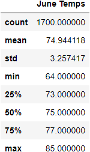

# Surfs_Up

## Project Overview: 
An analysis of June and December weather for Oahu, HI using SQLAlchemy to access a SQLite weather database.

## Background:

Our Investor "W. Avy" is considering opening a `Surf and Ice Cream shop in Oahu, HI.` In the past, he has invested in similar business opportunites which failed due to inclement weather. He has asked for a weather anaylsis of Oahu, specifically in the months of June and December to determine if this would be a viable investment year round. His business decision rides on the statistical analysis we will provide in this project.

 

 
<image src="Images/Oahu.jpg" width= "70%" height="50%"

 

## Outline: 

`SQLAlchemy` was used to connect and generate the queries needed to pull out neccessary information from the `SQLite` wheather database (`"hawaii.sqlite"`) we were provided. Below is a sample of the dependencies and functions that were used to access the SQLite database and start our weather analysis.

 

 

# June Weather Statistics:

The average temperature for June in Oahu, HI is 74.9°F  
- The highest temperature recorded was 85°F
- The lowest temperature recorded was 64°F

 

 

# December Weather Statistics:

The average temperature for December in Oahu, HI is 71.0°F  
- The highest temperature recorded was 83°F
- The lowest temperature recorded was 56°F

 

 
 

## Resources:

- hawaii.sqlite (Weather DataBase located in Resources folder)
- Software: Jupyter Lab, Pandas, Python, SQLite, SQLAlchemy, VS Code, FLASK, JSON

